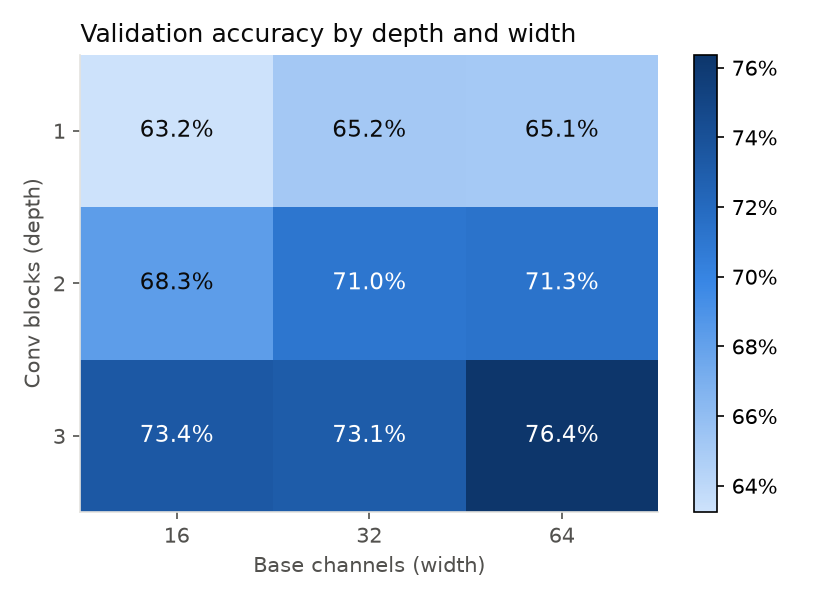
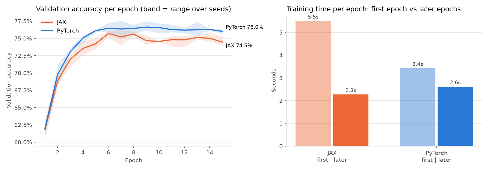
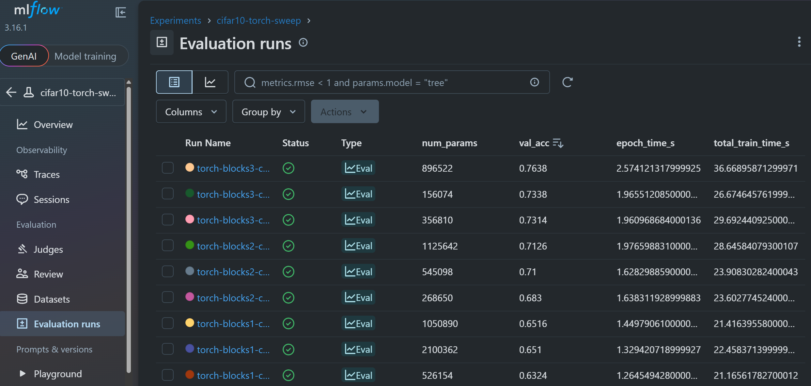

# Shallow CNN on CIFAR-10: PyTorch vs JAX


A small, end-to-end machine learning project in **Python** that trains the same
shallow convolutional network on CIFAR-10 in **PyTorch** and in **JAX**, manages
every experiment with **Hydra**, tracks all runs with **MLflow**, and analyses the
results with **pandas**.

**[See the results notebook →](notebooks/results.ipynb)** (outputs are saved, so nothing needs to be run)

## About this project

This is a learning and demonstration project. My earlier research was on improving
image classifiers with data augmentation of the training set, for situations where
data is difficult to obtain. I did that work in Keras/TensorFlow. Here I take the
same kind of problem, a small convolutional image classifier, and rebuild the whole
workflow with a different set of machine learning and data science frameworks:
PyTorch, JAX, Hydra, MLflow and pandas.

The goal was to use each tool for the job it is designed for, in one reproducible
experiment, and to document the results:

1. **Hyperparameter sweep (PyTorch + Hydra).** 9 configurations: 3 depths × 3 widths.
2. **Replication (JAX).** The winning architecture is trained in both frameworks, with 3 seeds each.
3. **Comparison (MLflow + pandas).** Runs are pulled from MLflow into DataFrames to compare accuracy and speed.

## Key findings

- **Depth mattered more than width.** Validation accuracy rose from 64.5% with one
  conv block to 70.2% with two and 74.3% with three (averaged over widths).
- **Parameter count predicted neither accuracy nor cost.** The model with the fewest
  parameters (156k) beat the one with the most (2.1M) by 8 points.
- **JAX reproduced the PyTorch model** with an identical parameter count (896,522) and
  trained at 1.15× the PyTorch speed after compilation.
- **PyTorch scored 1.2 points higher on the test set** (75.7% ± 0.3% against 74.5% ± 0.7%,
  mean ± standard deviation over 3 seeds).

All results below were produced on an NVIDIA RTX 4070 Laptop GPU under WSL2.

---

## How each tool is used

| Tool | Role in this project |
|---|---|
| **PyTorch** | Main implementation: model class and a hand-written training loop (`src/torch_model.py`) |
| **JAX** (Flax NNX + Optax) | Second implementation of the same model, written to mirror the PyTorch file (`src/jax_model.py`) |
| **Hydra** | All settings live in YAML under `conf/`; any value can be changed from the command line; `-m` runs the sweep |
| **MLflow** | Every run logs its config, per-epoch metrics, timings, confusion matrix, weights and Hydra config |
| **pandas** | `mlflow.search_runs` returns runs as a DataFrame; `src/results.py` ranks, pivots and aggregates them |

## The model

A deliberately shallow, VGG-style CNN, identical in both frameworks:

```
input 32×32×3
→ [Conv 3×3 → ReLU → MaxPool 2×2] × num_blocks      (block i has base_channels × 2^i filters)
→ Flatten → Dense 128 → ReLU → Dense 10
```

BatchNorm and Dropout are left out on purpose: in JAX they need extra state and
random-key handling, which would make the two implementations harder to compare.
No data augmentation is used either, so the numbers are a plain baseline.

Two hyperparameters are searched. Everything else is fixed: Adam, learning rate
0.001, batch size 128, 15 epochs.

| Hyperparameter | Values | Meaning |
|---|---|---|
| `model.num_blocks` | 1, 2, 3 | depth (number of conv blocks) |
| `model.base_channels` | 16, 32, 64 | width (filters in the first block, doubling in each later block) |

The data is split into 45,000 training, 5,000 validation and 10,000 test images.
The winner is chosen by **validation** accuracy; the **test** set is only used in stage 2.

---

## Results

### Stage 1: hyperparameter sweep (PyTorch)

Every run logged its parameter count, per-epoch metrics and training time to MLflow.
The table comes from comparing the 9 sweep runs (one seed per configuration).

| Conv blocks | Base channels | Parameters | Training time (15 epochs) | Validation accuracy |
|---:|---:|---:|---:|---:|
| 1 | 16 |   526,154 | 21.2 s | 63.2% |
| 1 | 32 | 1,050,890 | 21.4 s | 65.2% |
| 1 | 64 | 2,100,362 | 22.5 s | 65.1% |
| 2 | 16 |   268,650 | 23.6 s | 68.3% |
| 2 | 32 |   545,098 | 23.9 s | 71.0% |
| 2 | 64 | 1,125,642 | 28.6 s | 71.3% |
| 3 | 16 |   156,074 | 26.7 s | 73.4% |
| 3 | 32 |   356,810 | 29.7 s | 73.1% |
| 3 | 64 |   896,522 | 36.7 s | **76.4%** |



**Cost grows with the amount of convolution, not with the parameter count.**
Averaged over widths, training time rises from 21.7 s with one block to 25.4 s with two
and 31.0 s with three (+43%). Widening the network costs more the deeper it is: going
from 16 to 64 base channels adds 6% to the training time with one block, 21% with two
and 37% with three, because every extra block applies the wider filters again.

**Parameter count is a poor predictor of both cost and accuracy.** The model with the
most parameters (1 block × 64 channels, 2.1M) is one of the fastest to train and one of
the least accurate (65.1%). The model with the fewest (3 blocks × 16 channels, 156k)
has 13 times fewer parameters, takes 19% longer to train and is 8 points more accurate
(73.4%). The reason is where the parameters sit. With one block, 99.9% of them are in
the first dense layer, which is a single cheap matrix multiplication per image. Each
additional block halves that layer (pooling shrinks the feature map) and moves the
work into convolutions, which have few parameters but are applied at every pixel.

**The best model costs 1.7× the cheapest.** The winning configuration (3 × 64) reaches
76.4% validation accuracy in 36.7 s, against 63.2% in 21.2 s for the smallest network.

These numbers come from a single run per configuration, so differences of a few
percent between neighbouring configurations are within run-to-run noise.

### Stage 2: PyTorch vs JAX on the winning architecture

The 3 × 64 network was trained in both frameworks with 3 seeds each, to separate a
real difference from run-to-run variability, and evaluated on the test set.

| Framework | Parameters | Test accuracy (mean ± std) | First epoch | Later epochs | Total (15 epochs) |
|---|---:|---:|---:|---:|---:|
| PyTorch | 896,522 | 75.7% ± 0.3% | 3.4 s | 2.62 s | 40.1 s |
| JAX     | 896,522 | 74.5% ± 0.7% | 5.5 s | 2.28 s | 37.4 s |



**Accuracy.** PyTorch is 1.2 points ahead, and every PyTorch run beat every JAX run.
With 3 seeds per framework this is a consistent but small gap, not a conclusive one.
The probable cause is weight initialisation, the one thing the two versions do not
share: Flax's default initial weights have about 3 times the variance of PyTorch's.
I have not tested this yet (see next steps).

**Speed.** After the first epoch, JAX runs at 1.15× the PyTorch speed. JAX compiles
the training step with XLA during its first epoch (8.6 s in the first run of the
process), so the first epoch is reported separately. Even including compilation,
JAX finished the 15 epochs about 7% sooner.

**Per class.** The hardest class is dog (61% test accuracy) and the easiest is
automobile (87%). The notebook shows the full per-class breakdown and the most
common confusions.

### Experiment tracking in MLflow

All 9 sweep runs with their Hydra parameters and logged metrics:



Hyperparameters against validation accuracy:


Artifacts stored with each run (confusion matrix, weights, Hydra config):


### Keeping the comparison fair

- **Same data, same order.** Both frameworks read the same NumPy arrays from `src/data.py`,
  and the same seed gives identical batches. CIFAR-10 is downloaded once with torchvision
  (JAX ships no datasets of its own).
- **Same architecture.** A unit test checks that both versions have exactly the same number of parameters.
- **Several seeds.** Each framework is trained with 3 seeds, so differences can be told apart from noise.
- **Compilation is timed separately.** Speed is compared on the epochs after the first.
- One thing differs by design: PyTorch and Flax use different default weight initialisers.

### Next steps

- **Data augmentation.** Random crops and flips are the natural next experiment, and
  the topic of my earlier research. They should lift accuracy well above this baseline.
- **Matched initialisation.** Give the JAX model PyTorch's initialisers and check
  whether the 1.2-point gap closes.
- **More seeds** for the sweep, to put error bars on every configuration.

---

## Project structure

```
conf/
  config.yaml              defaults: seed, data split, training settings, MLflow
  model/shallow_cnn.yaml   num_blocks, base_channels, hidden_units
  framework/{torch,jax}.yaml
  experiment/sweep.yaml    stage 1: 3 x 3 grid with PyTorch
  experiment/compare.yaml  stage 2: torch,jax x seeds 0,1,2, with test evaluation
src/
  data.py                  download, split, normalise; shared batch iterator
  torch_model.py           PyTorch model and trainer
  jax_model.py             Flax NNX model and trainer (mirrors torch_model.py)
  train.py                 Hydra entry point; trains one run and logs it to MLflow
  results.py               MLflow -> pandas helpers and plots
  select_best.py           stage 1 ranking; prints the stage 2 command
  compare.py               stage 3 PyTorch vs JAX summary
notebooks/results.ipynb    the results, with outputs saved
tests/test_models.py       fast checks (no GPU, no download), run by GitHub Actions
results/                   tables and figures written by the scripts
docs/                      MLflow screenshots
```

## Setup

The project needs Linux for JAX's GPU support. On Windows, use **WSL2**
(`wsl --install -d Ubuntu` in PowerShell, then restart) with an up-to-date NVIDIA
driver on the Windows side. Everything below runs in the Ubuntu terminal.

```bash
git clone https://github.com/MatheusGolz/cifar10-torch-vs-jax.git
cd cifar10-torch-vs-jax
conda env create -f environment.yml
conda activate cifar10-torch-vs-jax
```

Check that both frameworks see the GPU:

```bash
python -c "import torch; print('PyTorch:', torch.cuda.is_available(), torch.version.cuda)"
python -c "import jax; print('JAX:', jax.devices())"
```

Expect `True` with a CUDA 13 version, and a `CudaDevice`. Without a GPU the code
still runs on CPU, only more slowly.

## Running the project

Run everything from the repository root, with the environment active.

```bash
# 0. Quick checks: unit tests, then a 1-epoch run (this also downloads CIFAR-10, ~170 MB)
pytest
python src/train.py train.epochs=1

# 1. Stage 1: the 9-run PyTorch sweep
python src/train.py -m +experiment=sweep
python src/select_best.py              # ranks the runs and prints the stage 2 command

# 2. Stage 2: the winner in PyTorch and JAX, 3 seeds each
python src/train.py -m +experiment=compare model.num_blocks=3 model.base_channels=64

# 3. Stage 3: compare the frameworks
python src/compare.py

# 4. Save the results into the notebook
jupyter nbconvert --to notebook --execute --inplace notebooks/results.ipynb
```

The whole pipeline takes about 10 minutes on the GPU above.

### Browsing runs in MLflow

```bash
mlflow ui --backend-store-uri sqlite:///mlflow.db
```

Open http://127.0.0.1:5000 and pick an experiment (`cifar10-torch-sweep` or
`cifar10-framework-comparison`).

### Trying other settings with Hydra

Any config value can be overridden from the command line:

```bash
python src/train.py framework=jax model.num_blocks=3 train.epochs=5 train.lr=0.0005
python src/train.py --cfg job       # print the final config without training
```

## How this was built

I built this project with an agentic programming workflow, working with an AI
coding agent (Claude). I set the experimental design (dataset, architecture, the two
hyperparameters, the PyTorch-then-JAX replication and the comparison method), the
agent wrote the code and tests, and I ran every experiment on my own hardware and
reviewed the results.
